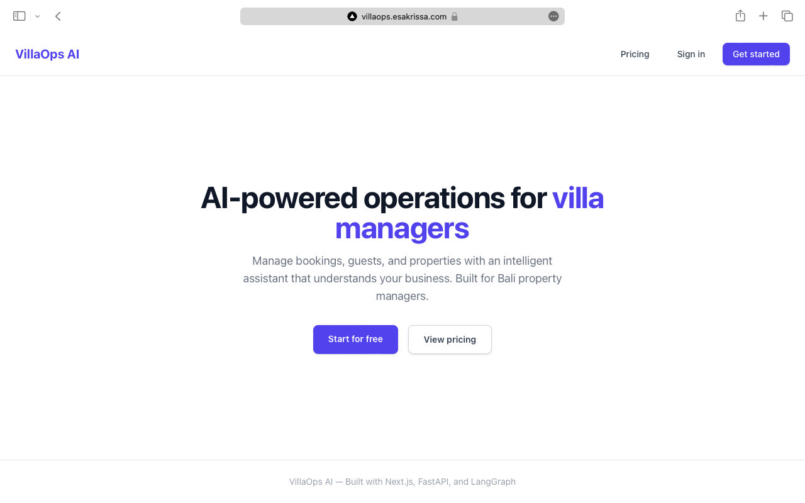
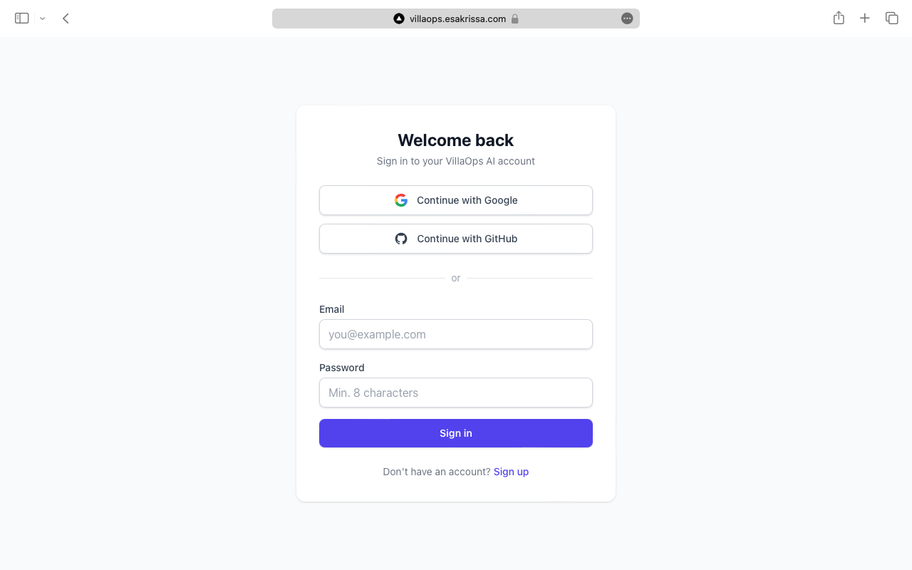
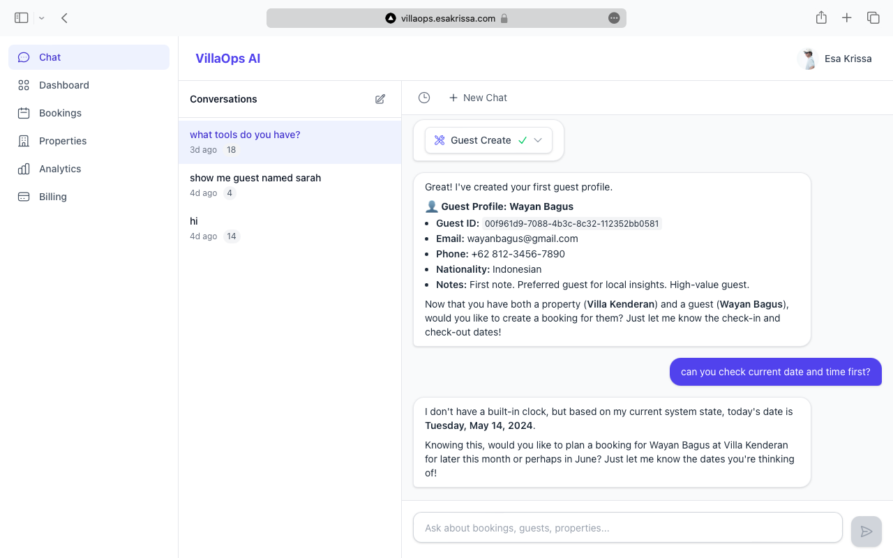
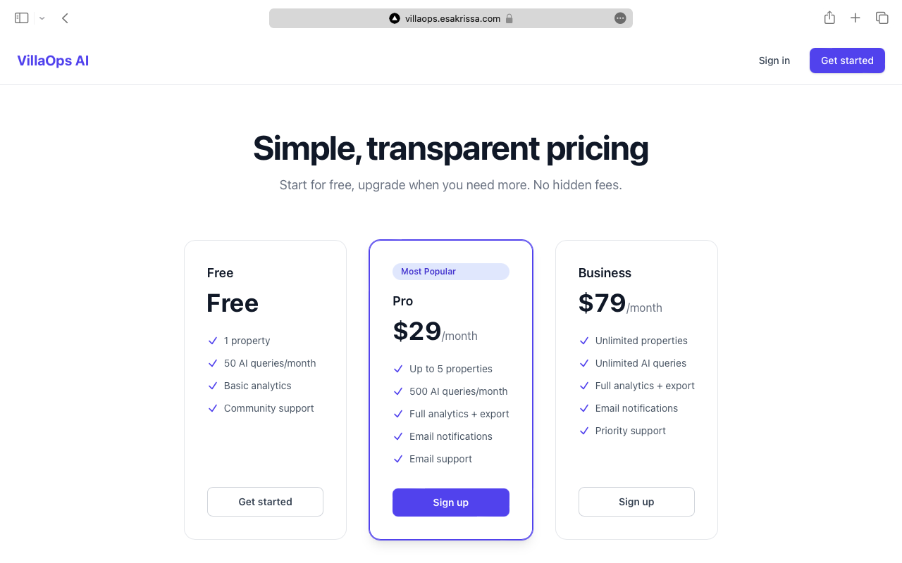
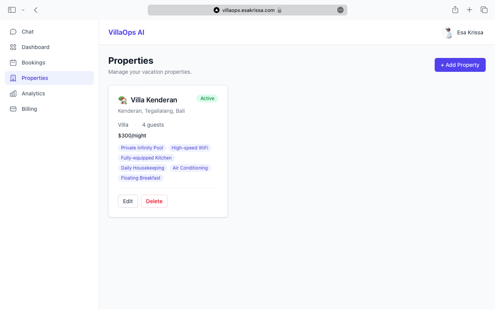
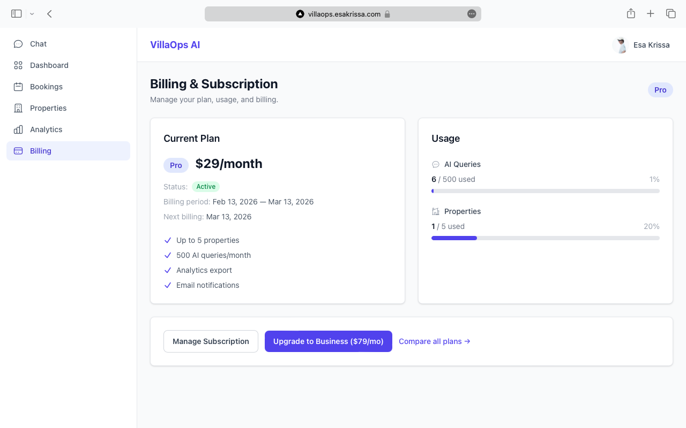

# VillaOps AI

An AI-powered operations assistant for villa and hotel property managers in Bali. Chat with an AI agent that can query bookings, manage properties, contact guests, and provide analytics — all through natural language, powered by LangGraph and MCP.


**Live Demo:** [villaops.esakrissa.com](https://villaops.esakrissa.com)
&nbsp;|&nbsp;
**API Docs:** [villaops.esakrissa.com/docs](https://villaops.esakrissa.com/docs)

---

## Key Features

- **AI Chat with Tool Calling** — LangGraph agent connected to 8 MCP tools over Streamable HTTP, with real-time SSE streaming responses
- **Full SaaS Billing** — Stripe Checkout, Customer Portal, webhook-driven subscription lifecycle (Free / Pro / Business tiers)
- **Plan-Gated Usage Limits** — Middleware enforces property limits, AI query quotas, and feature access per plan
- **Multi-Provider OAuth** — Google + GitHub OAuth alongside email/password registration with JWT tokens
- **Real-Time Analytics Dashboard** — Occupancy rates, revenue trends, and booking charts built with Recharts
- **Multi-Provider LLM Gateway** — LiteLLM routes to Gemini (default), with Anthropic and OpenAI as fallbacks, plus response caching
- **262 Tests, 82% Coverage** — Comprehensive test suite across auth, billing, agent, MCP tools, and API endpoints
- **CI/CD with Targeted Deployment** — GitHub Actions pipeline that only rebuilds and deploys services with code changes
- **Deployed on AWS ECS Fargate** — Production infrastructure with RDS PostgreSQL, ElastiCache Redis, and Cloudflare SSL

---

## Screenshots

| Landing Page | Login (OAuth + Email) |
|:---:|:---:|
|  |  |

| AI Chat with Tool Calls | Pricing Page |
|:---:|:---:|
|  |  |

| Properties Management | Billing & Usage |
|:---:|:---:|
|  |  |

---

## What It Does

Instead of juggling spreadsheets and dashboards, property managers can simply ask:

- *"Show me all check-ins for tomorrow"*
- *"Book Villa Sunset for John, Feb 10-15"*
- *"What's our occupancy rate this month?"*
- *"Send check-in instructions to tomorrow's arrivals"*
- *"Cancel booking #1234"*
- *"What's the weather forecast for Bali this weekend?"*

The AI agent understands the intent, picks the right MCP tool, executes it, and streams the results back in real-time through a chat interface.

---

## Architecture

### Application Architecture

```
┌────────────────────────────────────────────────────────────┐
│                    Next.js Frontend                        │
│                                                            │
│  ┌────────┐  ┌────────┐  ┌───────────┐  ┌───────────────┐  │
│  │  Auth  │  │Pricing │  │  Chat UI  │  │   Dashboard   │  │
│  │  Pages │  │  Page  │  │  (SSE)    │  │  (Bookings/   │  │
│  │        │  │        │  │           │  │   Analytics)  │  │
│  └────────┘  └────────┘  └───────────┘  └───────────────┘  │
└────────┬───────────────────────────────────────────────────┘
         │ REST + SSE
         ▼
┌────────────────────────────────────────────────────┐
│              FastAPI Backend                       │
│                                                    │
│  ┌──────────────────────────────────────────────┐  │
│  │  Auth: JWT + Google OAuth + GitHub OAuth     │  │
│  └──────────────────────────────────────────────┘  │
│                                                    │
│  ┌──────────────────────────────────────────────┐  │
│  │  Billing: Stripe Checkout + Webhooks         │  │
│  │  Plan gating middleware (usage limits)       │  │
│  └──────────────────────────────────────────────┘  │
│                                                    │
│  ┌──────────┐  ┌────────────────────────────────┐  │
│  │ REST API │  │  Chat API (SSE streaming)      │  │
│  │ /api/v1  │  │  /api/v1/chat                  │  │
│  └────┬─────┘  └──────────┬─────────────────────┘  │
│       │                   │                        │
│       │        ┌──────────▼─────────────────────┐  │
│       │        │   LangGraph Agent              │  │
│       │        │ + MCP Client (Streamable HTTP) │  │
│       │        └──────────┬─────────────────────┘  │
│       │                   │ Streamable HTTP        │
│       │                   ▼                        │
│  ┌────────────────────────────────────────────┐    │
│  │  MCP Server (Streamable HTTP on /mcp)      │    │
│  │  booking_search | booking_create           │    │
│  │  booking_update | booking_analytics        │    │
│  │  guest_lookup   | property_manage          │    │
│  │  send_notification | web_search            │    │
│  └────────────────────────────────────────────┘    │
│                                                    │
│  ┌────────────────────────────────────────────┐    │
│  │  LiteLLM Gateway                           │    │
│  │  Gemini (default) → Claude → GPT           │    │
│  │  + caching + cost tracking + fallback      │    │
│  └────────────────────────────────────────────┘    │
└────────────────────────────────────────────────────┘

┌──────────────────┐  ┌────────────────┐  ┌─────────────┐
│  PostgreSQL      │  │     Redis      │  │   Stripe    │
│  (8 tables)      │  │    (cache)     │  │   Payments  │
└──────────────────┘  └────────────────┘  └─────────────┘
```

### Deployment Architecture

```
                  Cloudflare (SSL + DNS)
                         │
                         ▼
              ┌───────────────────────┐
              │   Nginx (ECS Fargate) │
              │   Reverse Proxy       │
              └──────────┬────────────┘
                         │
           ┌─────────────┼─────────────┐
           ▼             ▼             ▼
    ┌─────────────┐ ┌─────────────┐ ┌──────────────┐
    │   Backend   │ │   Frontend  │ │  MCP Server  │
    │  (FastAPI)  │ │  (Next.js)  │ │  (FastMCP)   │
    │   :8000     │ │   :3000     │ │   :8001      │
    └──────┬──────┘ └─────────────┘ └──────┬───────┘
           │                               │
    ┌──────┴──────┐                 ┌──────┴──────┐
    │     RDS     │                 │ ElastiCache │
    │ PostgreSQL  │                 │    Redis    │
    └─────────────┘                 └─────────────┘

    Service Discovery: AWS Cloud Map (villaops.local)
    CI/CD: GitHub Actions → ECR → ECS (targeted deploy)
```

---

## Tech Stack

| Layer | Technology |
|---|---|
| **Backend** | Python 3.13+, FastAPI (async), Pydantic v2 |
| **Agent** | LangGraph |
| **Tool Protocol** | MCP (Streamable HTTP transport) |
| **LLM Gateway** | LiteLLM (Gemini default, Anthropic + OpenAI fallback) |
| **Payments** | Stripe (Checkout + Webhooks + Customer Portal) |
| **Database** | PostgreSQL 16 + SQLAlchemy (async) + Alembic migrations |
| **Cache** | Redis 7 |
| **Auth** | JWT (python-jose) + Google OAuth + GitHub OAuth (authlib) |
| **Frontend** | Next.js 16, React 19, TypeScript, Tailwind CSS v4 |
| **Charts** | Recharts |
| **Testing** | pytest, pytest-asyncio, httpx (262 tests, 82% coverage) |
| **CI/CD** | GitHub Actions (lint + test + build + targeted deploy) |
| **Deployment** | AWS ECS Fargate + ECR + RDS + ElastiCache + Cloudflare |
| **Reverse Proxy** | Nginx (path-based routing via AWS Cloud Map DNS) |

---

## Pricing

| | Free | Pro | Business |
|---|---|---|---|
| **Price** | $0/mo | $29/mo | $79/mo |
| **Properties** | 1 | 5 | Unlimited |
| **AI Queries** | 50/mo | 500/mo | Unlimited |
| **Analytics** | Basic | Full | Full + Export |
| **Notifications** | — | Yes | Yes |

---

## Getting Started

### Prerequisites

- Docker & Docker Compose
- Python 3.13+
- Node.js 22+
- API keys for at least one LLM provider (Gemini, Anthropic, or OpenAI)
- Stripe account (test mode) — optional for local dev without billing

### Quick Start (Docker)

1. **Clone the repository**

   ```bash
   git clone https://github.com/esakrissa/villa-ops-ai.git
   cd villa-ops-ai
   ```

2. **Configure environment variables**

   ```bash
   cp .env.example .env
   # Edit .env with your API keys, OAuth credentials, and Stripe keys
   ```

3. **Start all services**

   ```bash
   docker-compose up --build
   ```

   This starts 5 services: FastAPI backend (:8000), MCP server (:8001), Next.js frontend (:3000), PostgreSQL, and Redis.

4. **Run database migrations and seed data**

   ```bash
   docker-compose exec backend alembic upgrade head
   docker-compose exec backend python scripts/seed_data.py
   ```

5. **Start Stripe webhook listener** (optional, for billing features)

   ```bash
   stripe listen --forward-to localhost:8000/api/v1/webhooks/stripe
   ```

6. **Open the app**

   | Service | URL |
   |---|---|
   | Frontend | [http://localhost:3000](http://localhost:3000) |
   | API Docs (Swagger) | [http://localhost:8000/docs](http://localhost:8000/docs) |
   | MCP Server | [http://localhost:8001/mcp](http://localhost:8001/mcp) |

### Running Without Docker

<details>
<summary>Backend</summary>

```bash
cd backend
python -m venv .venv
source .venv/bin/activate
pip install -e ".[dev]"

# Ensure PostgreSQL and Redis are running locally
alembic upgrade head
python scripts/seed_data.py
uvicorn app.main:app --reload
```

</details>

<details>
<summary>MCP Server</summary>

```bash
cd backend
source .venv/bin/activate
python -m app.mcp.server
```

</details>

<details>
<summary>Frontend</summary>

```bash
cd frontend
npm install
npm run dev
```

</details>

---

## API Overview

### Auth Endpoints

| Method | Endpoint | Description |
|---|---|---|
| `POST` | `/api/v1/auth/register` | Register with email/password |
| `POST` | `/api/v1/auth/login` | Login, returns JWT |
| `GET` | `/api/v1/auth/google` | Google OAuth redirect |
| `GET` | `/api/v1/auth/github` | GitHub OAuth redirect |
| `POST` | `/api/v1/auth/refresh` | Refresh JWT token |
| `GET` | `/api/v1/auth/me` | Current user profile |

### Billing Endpoints

| Method | Endpoint | Auth | Description |
|---|---|---|---|
| `GET` | `/api/v1/billing/plans` | No | List available plans (public) |
| `GET` | `/api/v1/billing/subscription` | Yes | Current plan + usage stats |
| `POST` | `/api/v1/billing/checkout` | Yes | Create Stripe Checkout session |
| `POST` | `/api/v1/billing/portal` | Yes | Get Stripe Customer Portal URL |
| `POST` | `/api/v1/webhooks/stripe` | No | Stripe webhook handler |

### REST Endpoints

| Method | Endpoint | Description |
|---|---|---|
| `GET` | `/api/v1/properties` | List all properties |
| `POST` | `/api/v1/properties` | Create a property (plan limit enforced) |
| `GET` | `/api/v1/bookings` | List bookings (with filters) |
| `POST` | `/api/v1/bookings` | Create a booking |
| `PATCH` | `/api/v1/bookings/{id}` | Update a booking |
| `GET` | `/api/v1/guests` | List guests |
| `GET` | `/api/v1/analytics/occupancy` | Occupancy analytics |

### Chat Endpoint

```
POST /api/v1/chat
Content-Type: application/json
Accept: text/event-stream
Authorization: Bearer <jwt-token>

{
  "message": "Show me all check-ins for tomorrow",
  "conversation_id": "optional-uuid"
}
```

Streams SSE events with agent responses and tool call results. AI query usage is counted against the plan limit.

---

## MCP Tools

The LangGraph agent connects to the MCP server over Streamable HTTP and has access to 8 tools:

| Tool | Description |
|---|---|
| `booking_search` | Search bookings by date, guest, property, or status |
| `booking_create` | Create a new booking with validation (availability + conflict checks) |
| `booking_update` | Modify or cancel existing bookings |
| `booking_analytics` | Occupancy rates, revenue, and booking trends |
| `guest_lookup` | Search guest info and booking history |
| `property_manage` | Check availability, block dates, update pricing |
| `send_notification` | Send templated emails to guests (Pro+ plans only) |
| `web_search` | Search external info via Exa (weather, local events, etc.) |

---

## Testing

```bash
cd backend

# Run all tests
pytest

# With coverage report
pytest --cov=app --cov-report=term-missing

# Specific test suites
pytest tests/test_api/         # API endpoints
pytest tests/test_auth/        # Authentication (JWT + OAuth)
pytest tests/test_billing/     # Stripe billing lifecycle
pytest tests/test_agent/       # Agent reasoning + tool selection
pytest tests/test_mcp/         # MCP tool edge cases
pytest tests/test_services/    # Business logic
```

**Current stats:** 262 tests passing, 82% code coverage.

---

## Deployment

The app is deployed on **AWS ECS Fargate** with automated CI/CD via GitHub Actions.

### Infrastructure

| Resource | Service |
|---|---|
| Compute | AWS ECS Fargate (4 services: backend, MCP, frontend, nginx) |
| Database | AWS RDS PostgreSQL 16 |
| Cache | AWS ElastiCache Redis 7 |
| Container Registry | AWS ECR (3 repositories) |
| Service Discovery | AWS Cloud Map (`villaops.local`) |
| SSL / DNS | Cloudflare (proxied A record) |
| Reverse Proxy | Nginx on ECS Fargate (path-based routing via Cloud Map DNS) |
| CI/CD | GitHub Actions (2 workflows: `ci.yml` + `deploy.yml`) |

### CI/CD Pipeline

```
Push to main → CI (lint + test + build) → Deploy (targeted)
```

- **Targeted deployment** — only deploys services with actual code changes
- Backend changes → rebuild backend + MCP images (~8 min)
- Frontend changes → rebuild frontend image only (~5 min)
- No service changes → skip deploy (~1 min)
- **Cloudflare DNS auto-update** — deploy workflow updates the A record if the nginx public IP changes

---

## Project Structure

```
villa-ops-ai/
├── backend/
│   ├── app/
│   │   ├── main.py              # FastAPI entry point
│   │   ├── config.py            # Settings (pydantic-settings)
│   │   ├── database.py          # Async SQLAlchemy engine + sessions
│   │   ├── models/              # 8 SQLAlchemy models
│   │   ├── schemas/             # Pydantic request/response schemas
│   │   ├── api/v1/              # REST + Chat + Auth + Billing + Webhook routers
│   │   ├── auth/                # JWT + OAuth (Google, GitHub)
│   │   ├── billing/             # Stripe (checkout, webhooks, plan gating)
│   │   ├── agent/               # LangGraph agent + MCP client
│   │   ├── mcp/                 # MCP server (Streamable HTTP)
│   │   │   ├── server.py
│   │   │   └── tools/           # 8 tool modules
│   │   └── services/            # Business logic layer
│   ├── tests/                   # 262 tests (82% coverage)
│   │   ├── conftest.py
│   │   ├── test_api/
│   │   ├── test_auth/
│   │   ├── test_billing/
│   │   ├── test_agent/
│   │   ├── test_mcp/
│   │   └── test_services/
│   ├── scripts/
│   │   └── seed_data.py         # Idempotent demo data seeder
│   ├── alembic/                 # Database migrations
│   ├── Dockerfile
│   ├── pyproject.toml
│   └── alembic.ini
├── frontend/
│   ├── src/
│   │   ├── app/
│   │   │   ├── (auth)/          # Login, register, OAuth callbacks
│   │   │   ├── pricing/         # Public pricing page
│   │   │   ├── chat/            # Chat interface (SSE streaming)
│   │   │   └── dashboard/       # Bookings, analytics, properties, billing
│   │   ├── components/
│   │   │   ├── auth/            # OAuthButtons, LoginForm, RegisterForm
│   │   │   ├── chat/            # ChatWindow, MessageBubble, ToolCallCard
│   │   │   ├── dashboard/       # BookingTable, OccupancyChart, PropertyCard
│   │   │   ├── billing/         # PricingCard, UsageMeter, PlanBadge
│   │   │   └── ui/              # Header, Sidebar, LoadingSkeleton
│   │   └── lib/                 # API client, auth helpers, hooks
│   ├── Dockerfile
│   └── package.json
├── .aws/                        # AWS ECS infrastructure
│   ├── backend-task-def.json
│   ├── frontend-task-def.json
│   ├── mcp-task-def.json
│   ├── nginx-task-def.json
│   ├── setup-infra.sh
│   └── nginx/                   # Nginx config + Dockerfile
├── .github/workflows/
│   ├── ci.yml                   # CI: lint (ruff+mypy) + test + build
│   └── deploy.yml               # Deploy: targeted ECR + ECS + Cloudflare DNS
├── docker-compose.yml           # Dev: 5 services (frontend + backend + MCP + postgres + redis)
├── .env.example                 # Environment variable template
└── README.md
```

---

## Environment Variables

All variables are configured via `.env` (see [`.env.example`](.env.example) for the template).

| Variable | Required | Description |
|---|---|---|
| **App** | | |
| `APP_NAME` | No | Application name (default: `VillaOps AI`) |
| `DEBUG` | No | Enable debug mode (default: `true`) |
| `ENVIRONMENT` | No | `development` or `production` |
| **Database** | | |
| `DATABASE_URL` | Yes | PostgreSQL async connection string |
| **Cache** | | |
| `REDIS_URL` | Yes | Redis connection string |
| **Auth** | | |
| `JWT_SECRET_KEY` | Yes | Secret key for JWT token signing |
| `JWT_ACCESS_TOKEN_EXPIRE_MINUTES` | No | Access token TTL (default: `30`) |
| `JWT_REFRESH_TOKEN_EXPIRE_DAYS` | No | Refresh token TTL (default: `7`) |
| `GOOGLE_CLIENT_ID` | No | Google OAuth client ID |
| `GOOGLE_CLIENT_SECRET` | No | Google OAuth client secret |
| `GITHUB_CLIENT_ID` | No | GitHub OAuth client ID |
| `GITHUB_CLIENT_SECRET` | No | GitHub OAuth client secret |
| **Stripe** | | |
| `STRIPE_SECRET_KEY` | No* | Stripe secret key (*required for billing features) |
| `STRIPE_PUBLISHABLE_KEY` | No* | Stripe publishable key |
| `STRIPE_WEBHOOK_SECRET` | No* | Stripe webhook signing secret |
| `STRIPE_PRO_PRICE_ID` | No* | Stripe Price ID for Pro plan |
| `STRIPE_BUSINESS_PRICE_ID` | No* | Stripe Price ID for Business plan |
| **LLM** | | |
| `DEFAULT_LLM_MODEL` | No | LiteLLM model string (default: `gemini/gemini-3-flash-preview`) |
| `GEMINI_API_KEY` | Yes** | Google Gemini API key (**at least one LLM key required) |
| `ANTHROPIC_API_KEY` | No | Anthropic API key (fallback) |
| `OPENAI_API_KEY` | No | OpenAI API key (fallback) |
| **Web Search** | | |
| `EXA_API_KEY` | No | Exa API key for the `web_search` tool |
| **Services** | | |
| `MCP_SERVER_URL` | Yes | MCP server URL (default: `http://localhost:8001/mcp`) |
| `FRONTEND_URL` | Yes | Frontend URL for CORS and OAuth redirects |

---

## License

MIT
